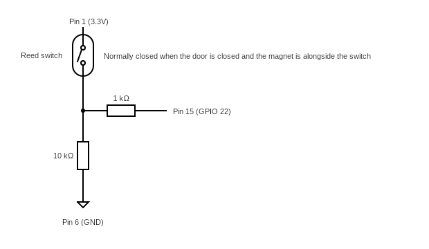
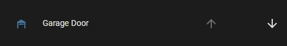

# RPi Garage Door Controller

## Setup

```
# Create a Python virtual environment
python -m venv .venv

# Activate the virtual environment
. .venv/bin/activate

# Install the required packages
pip install -r requirements.txt
```

---
## Run the application

Run `python waitress_serve.py` to start the application.

### Configuration

The application is configurable with the following environment variables

| Variable | Description | Mandatory | Example | Default |
| --- | --- | --- | --- | --- |
| RPI_GARAGE_DOOR_CONTROLLER_GPIO_OPEN | GPIO pin connected to the relay for opening the door | N | 10 | 17 |
| RPI_GARAGE_DOOR_CONTROLLER_GPIO_CLOSE | GPIO pin connected to the relay for closing the door | N | 10 | 27 |
| RPI_GARAGE_DOOR_CONTROLLER_GPIO_DOOR_STATE | GPIO pin connected to the door sensor | N | 10 | 22 |
| RPI_GARAGE_DOOR_CONTROLLER_HOST | Host IP to serve application on | N | 10.0.0.1 | 127.0.0.1 |
| RPI_GARAGE_DOOR_CONTROLLER_PORT | Host port to serve application on | N | 80 | 8080 |
| FLASK_DEBUG | Enables debug logs | N | true | false |

---
## API

Check door status, if it is opened or closed.
```
# Request
GET /garage_door

# Response
200
{
  "door_state": "open"
}
```

Open door.
```
# Request
POST /garage_door
{
  "door_state": "open"
}

# Response
201
{
  "door_state": "open"
}
```

Close door.
```
# Request
POST /garage_door
{
  "door_state": "closed"
}

# Response
200
{
  "door_state": "closed"
}
```

---

# Examples

## Deploying on Raspberry Pi

Below is a way of deploying the application on a Raspberry Pi:

### Hardware

The setup consists of 2 separate circuits:

1. Door sensor

    This is done by connecting a few pins on the Raspberry Pi with a reed switch and some resistors

    

1. Garage door controller

    Achieved using a [Raspberry Pi relay hat by Waveshare](https://www.waveshare.com/product/raspberry-pi/rpi-relay-board.htm). Connect 2 of the relays to the `Open` and `Close` contacts on the garage door operator circuit. The code by default uses relay 1 and 3, which are connected to GPIO 26 and GPIO 21 by default on the relay board.

### Software

1. Clone the repository
1. Setup the Python virtual environment as detailed in the `Setup` section.
1. Create a launch script, example:
    ```
    # /home/pi/run.sh
    WORKDIR=/home/pi/rpi_garage_door_controller

    export RPI_GARAGE_DOOR_CONTROLLER_HOST=0.0.0.0

    $WORKDIR/.venv/bin/python $WORKDIR/waitress_serve.py
    ```
1. Set launch script to be executable
    ```
    $ chmod +x run.sh
    ```
1. Set launch script to run on startup using `crontab`
    ```
    $ crontab -l 2>/dev/null; echo "@reboot /bin/sleep 10; /home/pi/run.sh" | crontab -
    ```
1. Reboot the Raspberry Pi

---

## Integration with Home Assistant

Create the following integrations in the Home Assistant `configuration.yaml`, replacing `application IP` and `application port` with the values corresponding to your application deployment.

```
# configuration.yaml
rest_command:
  open_garage_door:
    url: "http://<application IP>:<application port>/garage_door"
    method: POST
    content_type: "application/json"
    payload: '{"door_state": "open"}'
  close_garage_door:
    url: "http://<application IP>:<application port>/garage_door"
    method: POST
    content_type: "application/json"
    payload: '{"door_state": "closed"}'

sensor:
  - platform: rest
    resource: "http://<application IP>:<application port>/garage_door"
    name: Garage door
    value_template: "{{ value_json.door_state }}"

cover:
  - platform: template
    covers:
      garage_door:
        device_class: garage
        friendly_name: "Garage Door"
        value_template: "{{ states('sensor.garage_door') }}"
        open_cover:
          service: rest_command.open_garage_door
        close_cover:
          service: rest_command.close_garage_door
```

You should now have a `cover.garage_door` entity which can be included on the Lovelace Dashboard as such

```
type: entities
entities:
  - cover.garage_door
```


